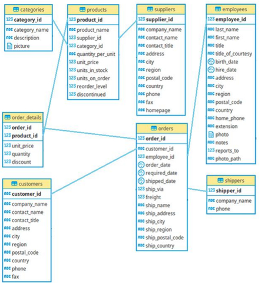
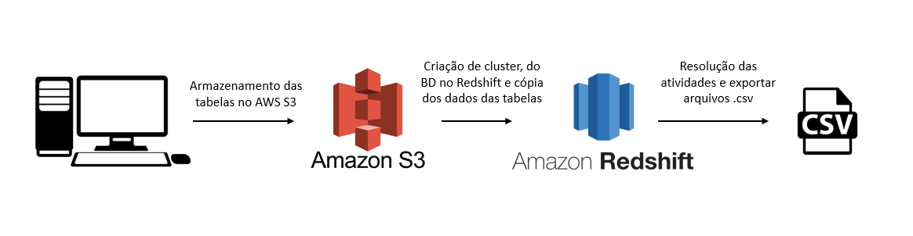

# Projeto1 - Datawarehouse Northwind

>Resolução de problemas de negócio simulados e soluções de requisições utilizando Datawarehouse AWS Redshift, AWS S3 e BD Relacional.

O presente projeto tem como objetivo simular requisições e problemas de negócios de uma empresa fictícia com um banco de dados Northwind (organização fictícia que gerencia pedidos, produtos, clientes, fornecedores,empregados, etc). 

O esquema do BD Relacional da empresa se dá de acordo com a imagem:

<!-- colocar screenshoot do seu projeto -->

## Preparação do ambiente

Para realizar as atividades propostas, utilizou-se da seguinte estrutura:
 
* Criação de Cluster Redshift
* Criação da estrutura do Datawarehouse Northwind 
* Upload dos arquivos .csv do PC Local para um bucket no AWS S3
* Cópia dos dados do AWS S3 para o datawarehouse no Redshift
* Resolução das atividades que simulam problemas de negócios e exportação de csv

## Atividades: 
 1. Gerar um relatório com os valores tabelados dos produtos e com os valores realmente executados nas vendas, exibindo a diferença entre esses valores e exibir a quantidade de produtos vendido por venda.    

 2. Agrupar o valor das vendas dos vendedores no ano de 2022 para analisar o desempenho do vendedor "Robert King".

 3. Selecionar os 10 produtos que tem os preços tabelados mais caros.

4. Mostar a quantidade de vendas total por fornecedor nos anos de 2021 e 2020 e a diferença entre o total de vendas desses anos.

5. Selecionar as 5 categorias que mais venderam em cada ano.

## Arquivos de resolução

Os arquivos de resolução se encontram anexados e separados por atividade. Consistem em scripts SQL e arquivos gerados no formato .csv

_______
## Meta

Link do curso: <https://www.udemy.com/course/engenheiro-de-dados/>

Bruno Augusto Pinto --- [Linkedin](https://www.linkedin.com/in/brunoaugp/) --- brunoaugp@hotmail.com

Currículo online: <https://brunoaugp.github.io/>

